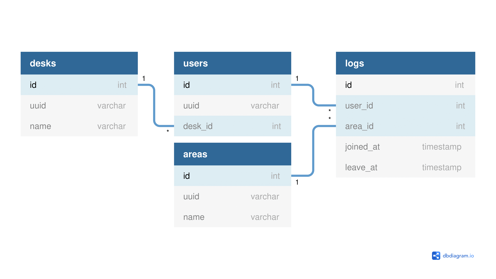

# サーバー

## 使い方

```shell
$ java -jar w3server.jar
```

```
Usage: java -jar w3server.jar <Command>
Commands:
    start -> サーバーを起動します
    desk -> 受付に関するコマンドです
    interact -> 対話モードを開始します
    version -> バージョンを表示します
    help -> コマンドヘルプを表示します
Flags:
    --debug, -D -> デバッグログを表示します
```

## 開発

### コマンド

#### ビルド

```shell
# Windows
gradlew.bat build

# Mac, Linux
./gradlew build
```

#### テスト

```shell
gradlew.bat test

# Mac, Linux
./gradlew test
```

#### 依存関係のバージョン確認

```shell
# Windows
gradlew.bat dependencyUpdates

# Mac, Linux
./gradlew dependencyUpdates
```

#### コードフォーマット

```shell
# Windows
gradlew.bat formatKotlin

# Mac, Linux
./gradlew formatKotlin
```

### 設計

#### データベース

[](https://dbdiagram.io/d/6149cd91825b5b01460c50de)
